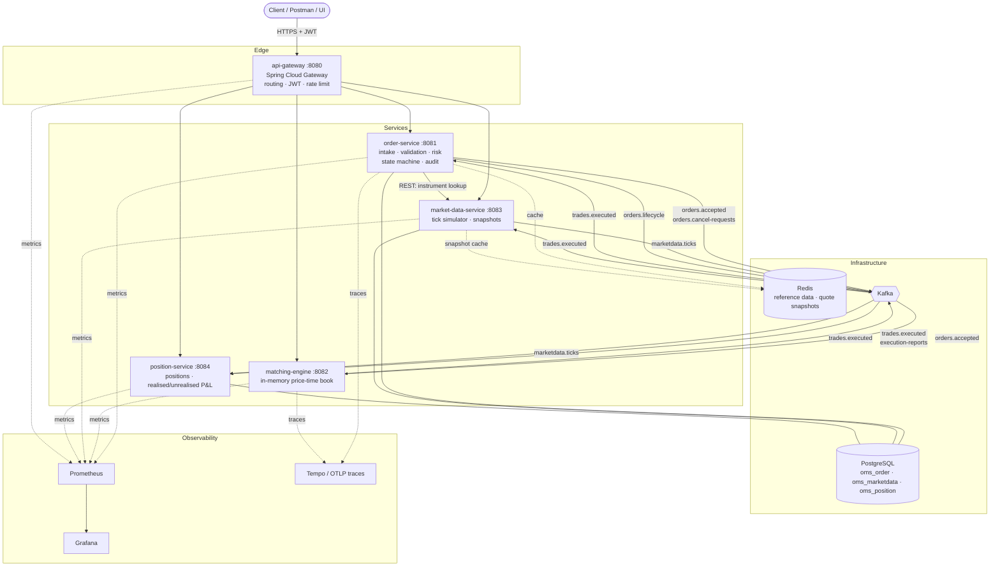

# Order Management & Market Data Platform

A simplified but architecturally serious equities trading backend: order intake with a full
audit trail, a price-time priority matching engine, a simulated market data feed, position and
P&L tracking, and pre-trade risk — built as five Spring Boot microservices over Kafka,
PostgreSQL and Redis.

> **Build status:** all 7 phases complete. `./mvnw test` is green: **330 tests**.
>
> The container, cluster and CI paths are written and statically checked but **have not been
> executed** — there is no Docker daemon on the machine this was authored on. See
> [deployment.md §7](docs/deployment.md#7-what-is-not-yet-verified) for exactly what to run
> first, in priority order.

**Start here:** [docs/talking-points.md](docs/talking-points.md) — the ten questions this project
attracts, with the answers, the numbers behind them, and what the measurements refuted.

## Why this project exists

Most Java portfolio projects are CRUD with extra steps. This one is built around the parts of
a trading backend that are actually hard: an append-only order lifecycle you can audit, a
matching engine whose concurrency and allocation behaviour is measured rather than asserted,
and event-driven boundaries where the ordering guarantees are a deliberate design decision
instead of an accident of configuration.

---

## Architecture



Source: [docs/diagrams/architecture.mmd](docs/diagrams/architecture.mmd). The life of a single
order — and specifically *where the `201` is returned relative to the Kafka publish* — is
[docs/diagrams/order-flow.mmd](docs/diagrams/order-flow.mmd).

**The two rules the diagram encodes.** Synchronous REST is only ever used for a query the caller
cannot proceed without (order-service asking for an instrument). Every state change crosses a
Kafka topic, keyed so that ordering is guaranteed exactly where ordering matters — per symbol on
the order path, per account on the position path.

---

## Stack

| Layer | Technology |
|---|---|
| Language | Java 21 LTS — records, sealed interfaces, exhaustive switch patterns, virtual threads ([ADR 0006](docs/adr/0006-target-java-21-not-17.md)) |
| Framework | Spring Boot 3.5, Spring Cloud Gateway 2025.0 |
| Persistence | PostgreSQL 16, Hibernate/JPA, Flyway — one schema per service, one DB role per service |
| Messaging | Apache Kafka (6 topics, versioned, documented, DLT on every consumer) |
| Cache | Redis 7 |
| Security | Spring Security, RS256 JWT with JWKS, role-based access, per-account rate limiting |
| API docs | OpenAPI 3 / springdoc — one Swagger UI aggregating five documents |
| Build | Maven multi-module, 9 modules (wrapper committed — a JDK is the only prerequisite) |
| Test | JUnit 5, Mockito, AssertJ, Testcontainers, JMH, ArchUnit |
| Ops | Docker Compose, Kubernetes manifests, GitHub Actions |
| Observability | Micrometer → Prometheus → Grafana, OTLP tracing across Kafka, JSON logs |

---

## API surface

All paths are behind the gateway on `:8080`. Obtain a token with
`POST /auth/token` (`{"username":"trader1","password":"..."}`); demo users are seeded at startup.

| Method | Path | Role | Purpose |
|---|---|---|---|
| `POST` | `/auth/token` | — | Issue an RS256 JWT |
| `GET` | `/oauth2/jwks` | — | Public key set; every service validates against it |
| `POST` | `/api/v1/orders` | `TRADER` | Place an order (LIMIT or MARKET, DAY/IOC/FOK) |
| `GET` | `/api/v1/orders` | `TRADER` `RISK` `ADMIN` | Page the caller's orders, filterable by status/symbol |
| `GET` | `/api/v1/orders/{id}` | `TRADER` `RISK` `ADMIN` | One order with its fills |
| `GET` | `/api/v1/orders/{id}/audit` | `TRADER` `RISK` `ADMIN` | The append-only audit trail |
| `DELETE` | `/api/v1/orders/{id}` | `TRADER` | Request cancellation (async — returns the order still live) |
| `GET` | `/api/v1/positions` | `TRADER` `RISK` `ADMIN` | Net quantity, exact open cost, realised P&L |
| `GET` | `/api/v1/pnl` | `TRADER` `RISK` `ADMIN` | Realised + unrealised, marked to the last tick |
| `GET` | `/api/v1/instruments` | authenticated | Reference data |
| `GET` | `/api/v1/quotes/{symbol}` | authenticated | Last tick |
| `GET` | `/api/v1/quotes/stream` | authenticated | SSE quote stream, **conflating** under backpressure |
| `GET` | `/api/v1/books/{symbol}` | `ADMIN` | Order book depth (reads a published snapshot, never the live book) |
| `GET` | `/actuator/**` | `ADMIN` | Health, metrics, Prometheus scrape |

`RISK` is read-only **by design**: a risk user who can place orders is not a risk control.
Swagger UI is at `/swagger-ui.html`. The error contract is one shape — `ApiError` with a
`traceId` that matches the log line and the span ([docs/order-service.md](docs/order-service.md)).

---

## Benchmark results

JMH, three implementations of the same contract, all passing the same 27 contract tests. Full
method, caveats and reproduction command: [docs/performance.md](docs/performance.md).

**Steady state (post an order, cancel an order — the dominant operation on a real venue):**

| Variant | 200 resting/side | 2,000 resting/side | Change with 10× depth |
|---|---|---|---|
| **Tuned book** | **13.83 ± 1.39 ops/µs** | **13.28 ± 1.03 ops/µs** | **−4%** |
| Idiomatic baseline | 8.81 ± 0.32 ops/µs | 1.92 ± 0.19 ops/µs | **−78%** |

| Variant | depth | mean | p50 | p99 | p99.9 |
|---|---|---|---|---|---|
| Tuned book | 2,000 | 0.107 µs | ≤0.1 µs | **0.30 µs** | — |
| Idiomatic baseline | 2,000 | 0.627 µs | 0.30 µs | 2.30 µs | 34.24 µs |

**The headline is the slope, not the ratio.** Tenfold the depth costs the tuned book 4% of its
throughput and the baseline 78% — that is O(1) against O(n) on the cancel path, and it is the one
fix that mattered. A single-point speedup can be argued about; a difference in scaling cannot.

**Two results worth more than the speedup:**

- **The baseline's mean latency is 55× its median** (11.1 µs vs 200 ns on the mixed workload).
  75% of operations are cheap and 25% are expensive, so the average describes neither population.
  That is why `oms_engine_match` publishes a percentile histogram and the alert is on p99.
- **One of my own hypotheses was refuted.** Node pooling cut allocation 30% (47.3 → 67.2 B/op) and
  did **nothing measurable** to throughput or latency — a generational collector reclaims dead
  objects for free, which is the inverse of the C++ intuition. The mechanism is still there; the
  document says plainly that the data does not justify it, and names the measurement that would
  settle it. [performance.md §5](docs/performance.md#5-the-negative-result-node-pooling-did-not-do-what-i-expected)

Hardware, clock granularity, collector choice and the three things *not* measured are all in
[performance.md §1 and §7](docs/performance.md#1-test-environment).

---

## Build

Only a JDK 21 or newer is required — Maven bootstraps itself through the wrapper.

```bash
./mvnw verify
```

```bash
./mvnw verify -Pcoverage-gate
```

On Windows use `mvnw.cmd`. `test` runs the unit suite; `verify` additionally runs the five
Testcontainers integration tests, which need a Docker daemon. The build is verified on JDK 25
compiling to `--release 21`. The brief asked for Java 17; 21 is a strict superset and is required
by two features the brief also asks for — virtual threads and pattern matching for `switch`. See
[ADR 0006](docs/adr/0006-target-java-21-not-17.md).

```bash
docker compose up --build
```

Brings up PostgreSQL, Kafka, Redis, all five services, Prometheus, Tempo and Grafana. The API is
on `:8080`, Swagger UI at `/swagger-ui.html`, Grafana on `:3000`. See
[docs/deployment.md](docs/deployment.md) — and note that this path is not yet verified.

```bash
./mvnw -pl matching-bench -am package -DskipTests
java -jar matching-bench/target/benchmarks.jar -f 2 -prof gc
```

Reproduces the benchmark table above (~11 minutes for the full matrix). The workload is seeded, so
two runs replay an identical stream.

---

## Documentation

**The two to read if you read two:** [talking-points.md](docs/talking-points.md) for the
decisions as an interviewer would probe them, and [concurrency.md](docs/concurrency.md) for the
engine's threading design in Java Memory Model terms with the C++ mapping.

| | Document | What it answers |
|---|---|---|
| 1 | [architecture.md](docs/architecture.md) | Service ownership, sync vs async rules, the end-to-end order flow, what is deliberately absent |
| 2 | [domain-model.md](docs/domain-model.md) | Ubiquitous language, the lifecycle and audit trail, why the event hierarchy is sealed, the risk checks |
| 3 | [kafka-event-design.md](docs/kafka-event-design.md) | Topics, partition keys and *why each key is that key*, delivery semantics, retry/DLT, schema evolution |
| 4 | [adr/](docs/adr/) | Seven decisions, with the rejected alternatives and the accepted costs |
| 5 | [jd-mapping.md](docs/jd-mapping.md) | Which component satisfies which job-spec line |
| 6 | [order-service.md](docs/order-service.md) | The first service in full: API, error contract, schema, risk suite, test pyramid |
| 7 | [matching-engine.md](docs/matching-engine.md) | The order book: data structure, matching algorithm, allocation discipline, recovery |
| 8 | [concurrency.md](docs/concurrency.md) | The threading design in JMM terms, with the C++ mapping |
| 9 | [performance.md](docs/performance.md) | The measure → fix → re-measure pass, including the refuted hypothesis |
| 10 | [market-data-service.md](docs/market-data-service.md) | The tick simulator, and why conflation is the only correct backpressure for a quote stream |
| 11 | [position-service.md](docs/position-service.md) | Average-cost P&L, why the state is exact cost, and the case implementations get wrong |
| 12 | [security.md](docs/security.md) | The authorisation matrix, why every service validates independently, what is not covered |
| 13 | [deployment.md](docs/deployment.md) | Images, the one-command stack, Kubernetes, CI — and §7, what is not verified |
| 14 | [observability.md](docs/observability.md) | Three signals, why the matching timer is a histogram, how a trace crosses Kafka |
| 15 | [talking-points.md](docs/talking-points.md) | The ten questions, the answers, and where C++ changed a decision |
| — | [ops/kafka-topics.md](ops/kafka-topics.md) | Topic provisioning and the operational commands that matter |

---

## Repository layout

```
oms-platform/
├── pom.xml                    parent: BOM imports, --release 21, JaCoCo, Surefire/Failsafe
├── mvnw, mvnw.cmd, .mvn/      Maven wrapper — no local Maven install needed
├── oms-common/                shared CONTRACTS only: domain enums, Ticks, sealed DomainEvent
│                              hierarchy, topic names, error contract. No JPA, no Spring Boot.
├── oms-web/                   shared Spring web plumbing (ApiError advice, trace-id filter,
│                              security, logback config), shipped as a Boot auto-configuration
│                              plus a test-jar of JWT fixtures
├── matching-bench/            JMH benchmarks for the order book. Not deployed.
├── order-service/       :8081 intake, validation, pre-trade risk, state machine, audit, outbox
├── matching-engine/     :8082 in-memory price-time priority order book
├── market-data-service/ :8083 tick simulator, Redis snapshots, conflating SSE quote stream
├── position-service/    :8084 positions, realised (average cost) and unrealised P&L
├── api-gateway/         :8080 Spring Cloud Gateway: routing, JWT issuance + JWKS, rate limiting
├── docs/                      15 documents, 7 ADRs, 2 diagrams, the raw JMH result JSON
├── ops/                       topic + Postgres bootstrap, Prometheus rules, Grafana dashboard
├── deploy/k8s/base/           Deployment/Service/PDB per service, ConfigMap, Secret,
│                              NetworkPolicies, Ingress, HPAs, kustomization
├── Dockerfile                 one parameterised multi-stage build for all five services
├── docker-compose.yml         the whole platform, one command
└── .github/workflows/ci.yml   unit, integration + coverage gate, manifest lint, image publish
```

---

## Design decisions worth reading first

If you only read seven things:

- **Why every order-path topic is keyed by symbol.** It gives the matching engine
  one-writer-per-book without a single lock, and it stops a cancel from overtaking the order it
  cancels. [kafka-event-design.md §2](docs/kafka-event-design.md)
- **Why prices are `long` ticks inside the engine and `BigDecimal` at the edges.** `BigDecimal`
  in an inner matching loop is sustained allocation pressure, and allocation pressure is a p99
  problem, not a throughput problem. [ADR 0002](docs/adr/0002-fixed-point-money-long-ticks-in-the-engine-bigdecimal-at-the-boundary.md)
- **Why at-least-once with idempotent consumers, not Kafka exactly-once.** EOS does not extend
  to the PostgreSQL write, which is where the money lands.
  [kafka-event-design.md §4](docs/kafka-event-design.md)
- **Why the matching engine is single-writer instead of lock-free.** Concurrent mutation of one
  book would destroy the price-time ordering the book exists to establish — the concurrency win
  is a partitioning decision, not a clever lock.
  [ADR 0005](docs/adr/0005-single-writer-per-book-not-a-lock-free-order-book.md)
- **Why trade ids are derived from `(symbol, sequence)` and never random.** The books are in
  memory, so recovery is a partition replay; with random ids a rebuild would double every position
  in the platform while the engine still looked correct. Recovery design and id generation are one
  decision. [concurrency.md §9](docs/concurrency.md)
- **Why the quote stream conflates instead of queueing.** An unbounded queue kills the process for
  everyone because of one slow client; conflation bounds memory by the symbol universe and gives a
  lagging subscriber the *freshest* price rather than a faithful replay of stale ones — and the
  published sequence number means the client can see it happened.
  [market-data-service.md](docs/market-data-service.md)
- **Why every service re-validates the JWT instead of trusting a gateway header.** Trusting the
  header means one network misconfiguration — a debug port, a stray `port-forward` — is a total
  authorisation bypass. The security boundary has to be the service, not the topology.
  [ADR 0007](docs/adr/0007-asymmetric-jwt-verified-at-every-service.md)

---

## What is not done, and what is next

Stated here rather than left for a reader to discover.

| | Status |
|---|---|
| **The container, cluster and CI paths have never been executed.** Dockerfile, compose, 11 Kubernetes manifests, the Actions workflow and five Testcontainers ITs are written and statically checked only. | [deployment.md §7](docs/deployment.md#7-what-is-not-yet-verified) lists them in priority order |
| **Cold-start recovery replays up to the full Kafka retention** (7 days). The fix is periodic book snapshots to a compacted topic so a rebuild replays only the tail. This is a worse problem than anything on the performance page, and it is the next thing to build. | [concurrency.md §9](docs/concurrency.md) |
| **The node pool's benchmark does not justify it.** Kept because it is cheap and the deciding measurement is named; a reviewer is entitled to say delete it. | [performance.md §5](docs/performance.md#5-the-negative-result-node-pooling-did-not-do-what-i-expected) |
| **`BigDecimal` and `ArrayList` costs are not separated** in the benchmark — the baseline changes four things at once. The isolating variant is one class and one `@Param`. | [performance.md §7](docs/performance.md#7-what-the-pass-actually-established) |
| **No jcstress harness** for the snapshot publication. A concurrency test is empirical companionship to the JMM argument, not proof of the absence of a race. | [concurrency.md §10](docs/concurrency.md) |
| **The gateway signs with an ephemeral RSA key** generated at startup, so tokens do not survive a restart. Correct for a demo, wrong for production, where this is a KMS or an external IdP. | [ADR 0007](docs/adr/0007-asymmetric-jwt-verified-at-every-service.md) |

**Deliberately out of scope**, because scope is a decision too: FIX protocol, multi-leg and
stop/iceberg order types, settlement and clearing, corporate actions, a real market data vendor,
and multi-region.

---

## Roadmap

| Phase | Contents | Status |
|---|---|---|
| 1 | Architecture, domain model, Kafka event design, Maven skeleton | ✅ Complete |
| 2 | order-service end to end: JPA, Flyway, risk, state machine, outbox, tests | ✅ Complete |
| 3 | matching-engine: order book, concurrency design, JMH harness, tuning pass | ✅ Complete |
| 4 | market-data-service (backpressure) + position-service (P&L) | ✅ Complete |
| 5 | api-gateway, Spring Security/JWT, OpenAPI | ✅ Complete |
| 6 | Docker Compose, Kubernetes, GitHub Actions, observability stack | ✅ Complete |
| 7 | Architecture diagrams, benchmark write-up, interview talking points | ✅ Complete |
